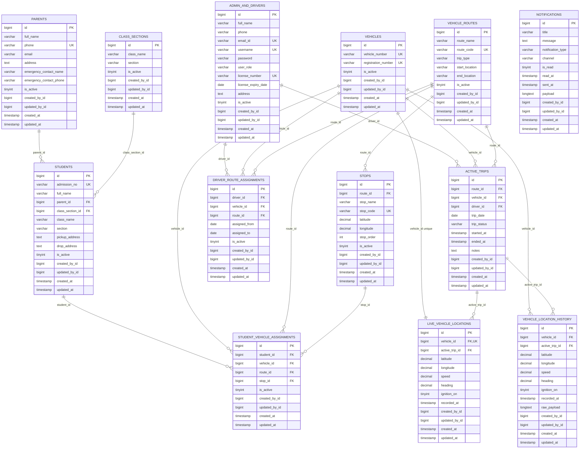

# school_001_db Schema Diagram

Verified from the local MySQL database `school_001_db`.

## School Bus Tracking ER Diagram

## Foreign Key Map

- `students.parent_id -> parents.id`
- `students.class_section_id -> class_sections.id`
- `stops.route_id -> vehicle_routes.id`
- `driver_route_assignments.driver_id -> admin_and_drivers.id`
- `driver_route_assignments.vehicle_id -> vehicles.id`
- `driver_route_assignments.route_id -> vehicle_routes.id`
- `student_vehicle_assignments.student_id -> students.id`
- `student_vehicle_assignments.vehicle_id -> vehicles.id`
- `student_vehicle_assignments.route_id -> vehicle_routes.id`
- `student_vehicle_assignments.stop_id -> stops.id`
- `active_trips.driver_id -> admin_and_drivers.id`
- `active_trips.vehicle_id -> vehicles.id`
- `active_trips.route_id -> vehicle_routes.id`
- `live_vehicle_locations.vehicle_id -> vehicles.id`
- `live_vehicle_locations.active_trip_id -> active_trips.id`
- `vehicle_location_history.vehicle_id -> vehicles.id`
- `vehicle_location_history.active_trip_id -> active_trips.id`

## Unique Indexes

- `admin_and_drivers.email_id`
- `admin_and_drivers.username`
- `admin_and_drivers.license_number`
- `class_sections.class_name + class_sections.section`
- `parents.phone`
- `students.admission_no`
- `vehicles.vehicle_number`
- `vehicles.registration_number`
- `vehicle_routes.route_code`
- `stops.stop_code`
- `live_vehicle_locations.vehicle_id`

## Other Tenant Tables

Laravel infrastructure tables in `school_001_db`: `cache`, `cache_locks`, `failed_jobs`, `jobs`, `job_batches`, `migrations`, `password_reset_tokens`, and `sessions`.
